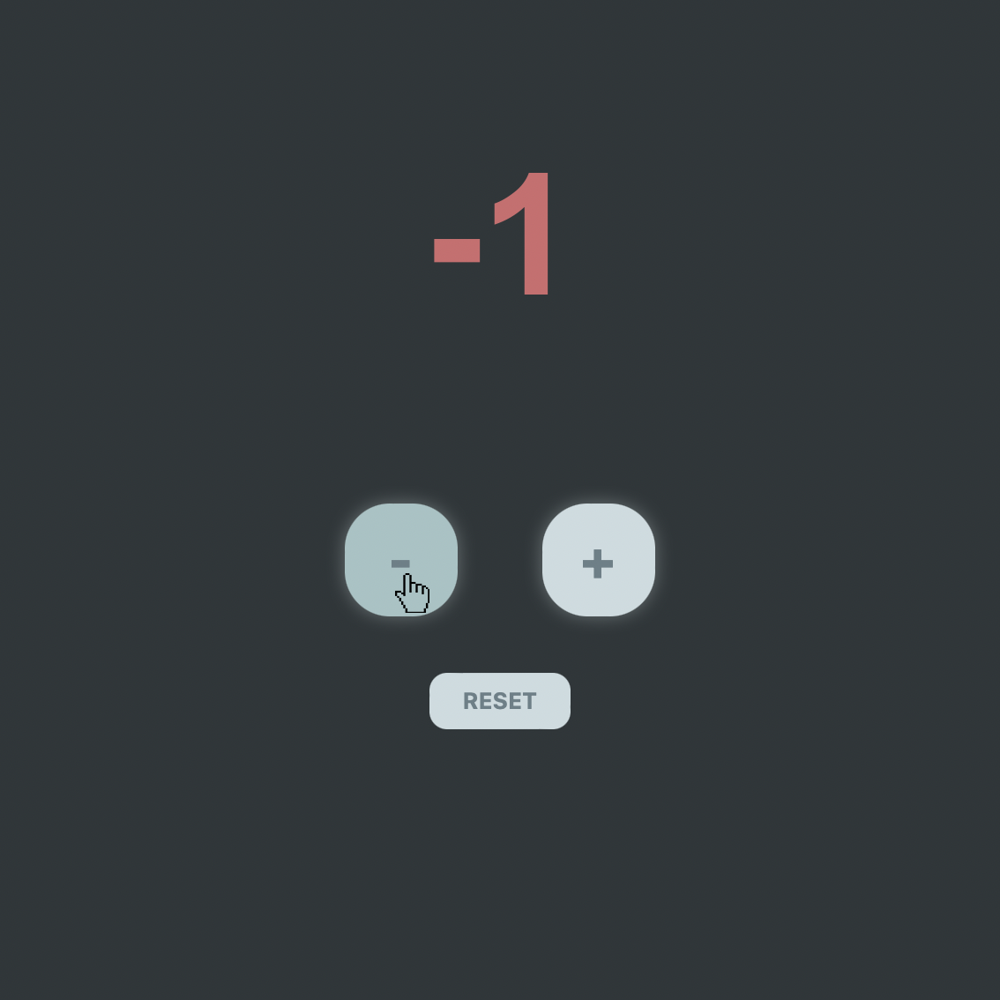

<div id="top"></div>

<!-- PROJECT LOGO -->
<br />
<div align="center">
  <a href="https://github.com/mhiagts/repo_name">
    
  </a>

<h3 align="center">Counter</h3>

  <p align="center">
    <br />
    a simple counter app made with Javascript
  </p>
</div>


<!-- TABLE OF CONTENTS -->
<details>
  <summary>Table of Contents</summary>
  <ol>
    <li>
      <a href="#about-the-project">About The Project</a>
      <ul>
        <li><a href="#built-with">Built With</a></li>
      </ul>
    </li>
    <li>
      <ul>
        <li><a href="#installation">Installation</a></li>
      </ul>
    </li>
    <li><a href="#usage">Usage</a></li>
    <li><a href="#contact">Contact</a></li>
  </ol>
</details>


<!-- ABOUT THE PROJECT -->
## About The Project


This is a simple counter app made with HTML, CSS and JS. <br/>
It has a + (increase) and a - (decrease) and also a RESET button. <br/>
It can display positive (which will be displayed green) and negative (which will be displayed red) numbers depending on which button you click on.


<p align="right">(<a href="#top">back to top</a>)</p>


### Built With

* [Html](https://html.spec.whatwg.org/)
* [Css](https://www.w3.org/TR/CSS/)
* [Javascript](https://developer.mozilla.org/en-US/docs/Web/JavaScript?retiredLocale=it)


<p align="right">(<a href="#top">back to top</a>)</p>


### Installation

for a local copy of the project on your pc simply clone the github repo
1. Clone the repo
   ```sh
   https://github.com/Mhiagts/Counter
   ```
2. Open the index.html
3. Enjoy my counter App!

<p align="right">(<a href="#top">back to top</a>)</p>


<!-- USAGE EXAMPLES -->
## Usage

You can use this app for counting positive numbers just by clicking on + <br/>
<br/>

<br/>
<br/>

or nevative numbers by clicking on - <br/>
<br/>

<br/>
<br/>

If you want to go back to 0 you just have to click on the RESET button or you can reload the page. <br/>
<br/>


<p align="right">(<a href="#top">back to top</a>)</p>


<!-- CONTACT -->
## Contact

Elisa Remondini - elisaremondini20@gmail.com

Project Link: https://counter-js-er.netlify.app

<p align="right">(<a href="#top">back to top</a>)</p>


<!-- MARKDOWN LINKS & IMAGES -->
<!-- https://www.markdownguide.org/basic-syntax/#reference-style-links -->
[product-screenshot]: images/screenshot.png
